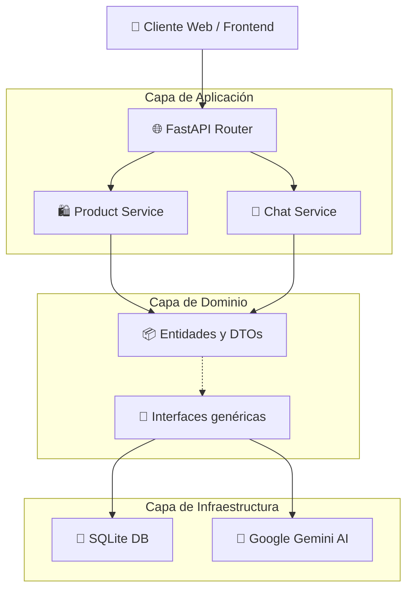

# E-commerce con Chat IA

## Descripción
API REST de e-commerce de zapatos con chat inteligente usando Clean Architecture.

## Arquitectura del Proyecto (Clean Architecture)



## Estructura de Carpetas

```text
📦 e-commerce-chat-ai
 ┣ 📂 evidencias/         # Capturas de pantalla para la rúbrica
 ┣ 📂 frontend/           # Interfaz Gráfica Web (Lau Kicks)
 ┃ ┗ 📜 index.html
 ┣ 📂 src/
 ┃ ┣ 📂 domain/           # Reglas de negocio (Entidades, Interfaces)
 ┃ ┣ 📂 application/      # Orquestación y casos de uso (Servicios, DTOs)
 ┃ ┗ 📂 infrastructure/   # Bases de datos, APIs externas (FastAPI, SQLite, Gemini)
 ┣ 📂 tests/              # Pruebas Unitarias automatizadas
 ┣ 📜 docker-compose.yml  # Manifiesto de contenedores
 ┣ 📜 Dockerfile          # Receta y pasos de compilación
 ┣ 📜 requirements.txt    # Librerías en Python (.venv)
 ┗ 📜 README.md           # Documentación principal
```

## Tecnologías
- Python 3.11
- FastAPI
- SQLAlchemy
- Google Gemini AI
- Docker
- Pytest

## Instalación

### Requisitos Previos
- Python 3.10+
- Docker y Docker Compose
- API Key de Google Gemini

### Pasos
1. Clonar repositorio
```bash
git clone <tu-repo>
cd e-commerce-chat-ai
```

2. Crear entorno virtual
```bash
python -m venv venv
source venv/bin/activate # Mac/Linux
# venv\Scripts\activate # Windows
```

3. Instalar dependencias
```bash
pip install -r requirements.txt
```

4. Configurar variables de entorno
```bash
cp .env.example .env
# Editar .env y agregar tu GEMINI_API_KEY
```

5. Ejecutar con Docker
```bash
docker-compose up --build
```

## Uso
- Interfaz Frontend (Tienda Lau Kicks): http://localhost:8000
- Documentación Swagger: http://localhost:8000/docs
- Redoc: http://localhost:8000/redoc

## Endpoints API
- GET /api/products - Lista todos los productos disponibles
- GET /api/products/{id} - Obtiene detalles de un producto específico
- POST /api/chat - Envía un mensaje a la asesora web IA
- GET /api/chat/history/{session_id} - Extrae el historial cronológico de la conversación
- DELETE /api/chat/history/{session_id} - Suprime el caché de la conversación

## Tests
```bash
pytest
```

## Autor
Laura Sofía Jiménez Paris - Universidad EAFIT
